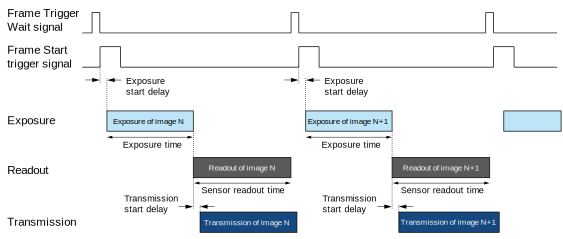
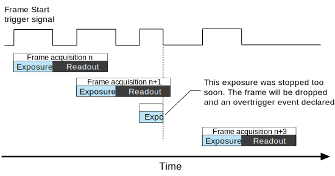
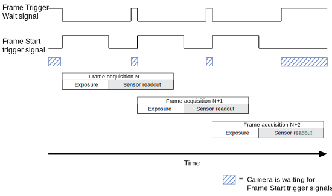
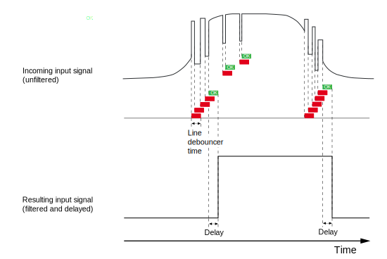

# Theia
Scripts to control the image prototyping station.


## Table of contents

* [Introduction](#introduction)
* [ASI Stage](#asi-stage)
* [Basler Camera](#basler-camera)
* [Adafruit MatrixPortal](#adafruit-matrixportal)
* [Micro-Manager](#micro-manager)
* [Useful Links](#useful-links)


## Introduction

This project contains scripts to control an XYZF ASI stage, CRISP autofocus module, and Basler camera.


## ASI Stage

General information about the ASI Stage and hardware subsystems can be found at [ASIImaging](https://www.asiimaging.com/). To control the stage from a computer through USB, install the necessary drivers from [Silicon Labs](https://www.asiimaging.com/support/downloads/usb-support-on-ms-2000-wk-controllers/). If running Windows, the [ASI Console](https://www.asiimaging.com/support/downloads/asi-console/) can be used to flash the MS-2000 firmware as well as troubleshoot serial connection and hardware bugs. For other issues, contact ASI technical support at (541) 461 8181 (Eugene, OR). Request Steve Saltekoff or Brandon Simpson, the main developers of the ASI drivers for Micro-Manager.

**Note:** our stage setup has linear encoders with 10nm resolution and lead screws with the "Ultra Coarse" pitch designation.

### Firmware

The stage firmware has been updated to include the CRISP, reduced count, scan, and encoder output modules (ADEPT_XYZPF_CRISP_RC_SCAN_ENC_INT). Whenever flashing the MS-2000, the default configuration may need to be modified to reflect our hardware setup. First, query the configuration:

```console
CCA X?
```

The MS-2000 should respond with the following:

```console
:A A: XY:L1Do Z:R1Do F:P5
```

If that is not the case, refer to page 51 of the manual (see links below), which explains the meaning behind each configuration flag.

To change the encoder setting from rotary (R) to linear (L), power down the MS-2000 and flip dip-switch 3 to position DOWN. The configuration should automatically update to reflect these changes, but if not, execute the following command sequence:

```console
CCA X=1
RESET
```

To set the lead screw pitch to "Ultra Coarse", execute the following sequence:

```console
CCA X=18
RESET
```

All previous firmware versions have been included in this repository for reference, though only the **ADEPT_XYZPF_CRISP_SL_RC** and **ADEPT_XYZPF_CRISP_RC_SCAN_ENC_INT** are usable&mdash;this is because the other versions either have conflicting modules or are missing the "reduced count" module, which is needed for the linear encoders.

| Firmware Version                      | Modules                                               | Comments                              |
| ------------------------------------- | ----------------------------------------------------- | ------------------------------------- |
| ADEPT_XYZPF_CRISP_SL                  | CRISP, solenoid lock                                  | Issues with linear encoder setting    |
| ADEPT_XYZPF_CRISP_SL_RC               | CRISP, solenoid, reduced count                        | None                                  |
| ADEPT_XYZPF_CRISP_SL_RC_SCAN_ENC_INT  | CRISP, solenoid, reduced count, scan, encoder output  | Conflicting modules                   |
| ADEPT_XYZPF_CRISP_SCAN_ENC_INT        | CRISP, scan, encoder output                           | Issues with linear encoder setting    |
| ADEPT_XYZPF_CRISP_RC_SCAN_ENC_INT     | CRISP, reduced count, scan, encoder output            | Correct firmware assembly             |

To query the installed firmware modules:

```console
BU X?
```

### Useful Serial Commands

| Command           | Shortcut      | Description                                                                   |
| ----------------- | --------------| ----------------------------------------------------------------------------- |
| `RBMODE Y=15`     | `RM Y=15`     | Enable control over all axes for sequence acquisitions                        |
| `SAVESET X`       | `SS X`        | Reset configuration to default&mdash;must `RESET` for changes to take effect  |
| `SAVESET Z`       | `SS Z`        | Save configuration to flash memory for persistent settings                    |

### CRISP Continuous Autofocus System

To use the CRISP module with Micro-Manager, follow the [plugin instructions from ASI](https://asiimaging.com/docs/crisp_mm_plugin).

## Basler Camera

### IO Connections/Pinout

The following table lists each IO connection along with its corresponding line (the string value used to reference the wire in the API), pinout, and color (the cable insulation color used for identification).

| IO                                | Line    | Pin   | Wire     |
| --------------------------------- | ------- | ----- | -------- |
| Opto-isolated IO IN               | Line1   | 2     | Pink     |
| Opto-isolated IO OUT              | Line2   | 4     | Yellow   |
| Direct-coupled GPIO               | Line3   | 1     | Brown    |
| Direct-coupled GPIO               | Line4   | 3     | Green    |
| Ground for opto-isolated IO       | -       | 5     | Gray     |
| Ground for direct-coupled GPIO    | -       | 6     | White    |

### Acquisition Configuration

The following table details an example acquisition series where an external processor listens for the [**Frame Trigger Wait**](https://docs.baslerweb.com/line-source.html#trigger-wait) signal before sending the [**Frame Start**](https://docs.baslerweb.com/trigger-selector#frame-start-end-and-active-trigger) trigger signal to start the exposure, readout, and transmission events. Note that it is not necessary to wait for the **Frame Trigger Wait** signal, so long as the **Frame Start** trigger does not coincide with an active exposure (see below).



As mentioned previously, the Basler ACA2040 120um area scan camera has, as default, overlapping image acquisition, meaning that the device can [begin a new exposure while still reading out sensor data from the previous acquisition](https://docs.baslerweb.com/overlapping-image-acquisition). In this case, "reading out" sensor data refers to the [transfer of sensor pixel values to the image buffer](https://docs.baslerweb.com/acquisition-timing-information#sensor-readout-time), not the actual data transmission to the host computer.



If a trigger signal is received during an active exposure, the camera will ignore the signal and declare a **Frame Start Overtrigger** event. Note that handlers must be declared and registered with the camera to [manage events](https://docs.baslerweb.com/event-notification). Overtriggering may be avoided by monitoring the **Frame Trigger Wait** signal&mdash;contrary to what is represented in the first chart, the **Frame Trigger Wait** signal may be emitted *during* sensor readout if the camera is ready for a new acquisition (see below).



By default, the camera operates in [**Timed Exposure Mode**](https://docs.baslerweb.com/exposure-mode#timed-exposure-mode), where the exposure time is explicitly declared and an acquisition cycle started on the trigger signal. However, there is an alternative configuration, called [**Trigger Width Exposure Mode**](https://docs.baslerweb.com/exposure-mode#trigger-width-exposure-mode), that controls exposure time based on the pulse duration of the **Frame Start** hardware trigger signal. This allows for variable exposure times between acquisitions. To enable this feature, set the **ExposureMode** parameter to **TriggerControlled**. (Make sure to check whether the camera is configured for *rising* or *falling* edge trigger signals!) It is also good practice to set the [**Exposure Overlap Time Max**](https://docs.baslerweb.com/exposure-overlap-time-max) value to the lowest expected exposure time to avoid overtriggering. For either mode, an estimate of the camera frame rate&mdash;based on the current parameters&mdash;can be queried from the [**ResultingFrameRate**](https://docs.baslerweb.com/resulting-frame-rate#checking-the-resulting-frame-rate) attribute.

When the pulse duration of the hardware trigger signal is known, it may be useful to set the [**Line Debouncer**](https://docs.baslerweb.com/line-debouncer) time&mdash;a floating point value in microseconds&mdash;to prevent unexpected triggering.




## Adafruit MatrixPortal

The [MatrixPortal M4](https://learn.adafruit.com/adafruit-matrixportal-m4/overview) is a microcontroller board with WiFi connectivity that is designed to operate [LED matrix panels](https://learn.adafruit.com/rgb-led-matrices-matrix-panels-with-circuitpython/overview) using a CircuitPython library called [displayio](https://learn.adafruit.com/circuitpython-display-support-using-displayio/introduction). 


## Micro-Manager

To use Micro-Manager, install the latest 2.0 release from the [nightly builds](https://download.micro-manager.org/nightly/2.0/Windows/). Follow the [configuration guide](https://micro-manager.org/Micro-Manager_Configuration_Guide) to create a config file for the specific hardware. Users are directed to the [ASIStage page](https://micro-manager.org/ASIStage) of the Micro-Manager documentation for further information.

### Device Property Browser

Micro-Manager software configurations are managed through a device property browser (Devices/Device Property Browser...). On the lefthand side of the browser window, the user can toggle the view of properties based on the device. Notably, one of these properties enables sequence triggering (TTL) of the ASI focus axis, which can be either the linear Z or piezo F. (More information on Micro-Manager hardware triggering can be found in the [documentation](https://micro-manager.org/Hardware-based_Synchronization_in_Micro-Manager).) Depending on the firmware version, this method restricts z-stack acquisitions to 50 slices, a limitation imposed by the buffer size.

| Property                          | Purpose                                                       |
| --------------------------------- | --------------------------------------------------------------|
| BaslerCamera-PixelType            | Set image acquisiiton to 8-bit (Mono8) or 16-bit (Mono12)     |
| ZStage-Use Sequence               | "Yes" prepares the stage focus axis for hardware triggering   |
| Core-Focus                        | Set the focus axis to linear Z (ZStage) or piezo F (FStage)   | 


## Useful Links

Tutorials, manuals, datasheets, and parts...

#### ASI

* [MS-2000 XY Piezo Stage Manual](https://www.asiimaging.com/downloads/manuals/ASI-PZ-WK-Inverted-XY.pdf)
* [MS-2000 Operation](https://asiimaging.com/docs/ms2000_operation)
* [MS-2000 Serial Communication Setup](https://www.asiimaging.com/docs/tech_note_rs232_comm)
* [ASI CRISP Manual](https://www.asiimaging.com/downloads/manuals/CRISP%20Autofocus%20Manual.pdf)
* [ASI Python Quick Start](https://asiimaging.com/docs/python)
* [ASI Serial Commands Quick Start](https://www.asiimaging.com/docs/command_quick_start)

#### Basler

* [Basler Online Documentation](https://docs.baslerweb.com/cameras)
* [Basler Ace User Manual](https://graftek.biz/system/files/2576/original/Basler_Ace_USB_3.0_Manual.pdf?1479057814)
* [Blog: Getting Started With Basler Cameras](https://www.pythonforthelab.com/blog/getting-started-with-basler-cameras/)
* [Basler Pylon SDK Manual](https://www.baslerweb.com/fp-1615186793/media/downloads/documents/users_manuals/AW00148804000_pylon_SDK_Samples_Manual.pdf)
* [Basler Pylon SDK Webinar](https://www.baslerweb.com/en/company/news-press/webinar/pylonc/vod-pylonc/)
* [Basler Pylon Python Examples](https://github.com/basler/pypylon/tree/master/samples)
* [Basler I/O Connector Cable](https://www.mouser.com/ProductDetail/405-2200000625)

#### Adafruit

* [LED Matrix Panel 64x64](https://www.adafruit.com/product/5362)
* [CircuitPython displayio Guide](https://learn.adafruit.com/circuitpython-display-support-using-displayio/introduction)
* [Display Shapes Library API](https://docs.circuitpython.org/projects/display-shapes/en/latest/api.html)
* [MatrixPortal M4](https://learn.adafruit.com/adafruit-matrixportal-m4)
* [MatrixPortal Library](https://docs.circuitpython.org/projects/matrixportal/en/latest/)
